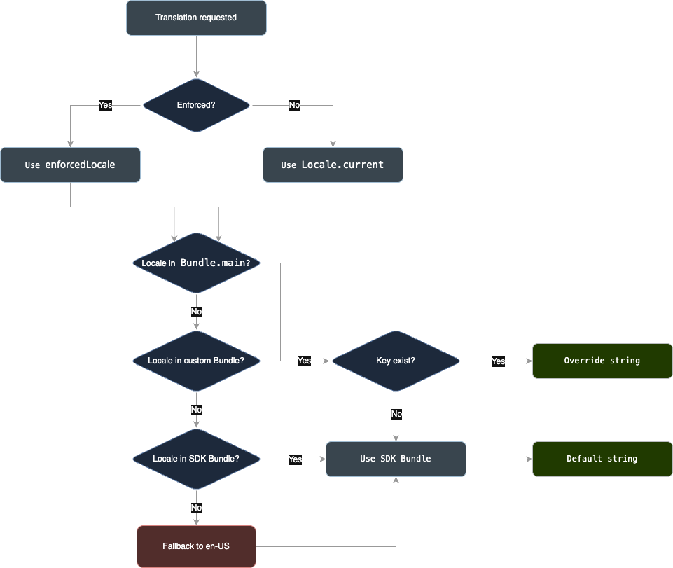

# Localization

The SDK allows you to customize UI strings and manage locale behavior using the `LocalizationParameters` object. You can configure these settings for both the Drop-in and individual Components through their `configuration.localizationParameters` property.

Based on this configuration, the SDK provides two methods for handling language and regional formatting:

- **[iOS Default](https://developer.apple.com/library/archive/qa/qa1828/_index.html) Localization:**
  The SDK matches the shopper's device language and regional settings when their locale is listed in your app's `CFBundleLocalizations` array in the `Info.plist` file. If the locale for your shopper's device language isn't found, the locale defaults to `en-US` for UI text. Amount and date formatting may still adhere to the shopper's device region.

- **Enforced Localization:**
  You enforce a specific locale (e.g., `"fr-FR"`) by using `LocalizationParameters(enforcedLocale: "fr-FR"`. This ignores the shopper's device preferences, and all UI text and data formatting (like currency, dates, numbers) use the conventions of the enforced locale. Using an enforced locale allows you to target a single language, achieve uniform branding, or implement an in-app language switcher.

## How device locales affect monetary formatting

The default iOS localization can lead to significant variations in how monetary values are displayed based on the shopper's device locale settings.

For instance, if your app's `CFBundleLocalizations` array consist of English, French, and Chinese (Mainland) locales, and the transaction amount is **12,340 Chinese Yuan (CNY)** (twelve thousand three hundred forty), below is how your app will display the amount, formatted according to their device's regional settings:

| User's Device Language | User's Device Region | Example Pay Button Label (for 12,340 CNY) |
| :--------------------- | :------------------- | :---------------------------------------- |
| `zh` (Chinese)         | `CN` (China)         | `¥12,340.00`                              |
| `fr` (French)          | `FR` (France)        | `12 340,00 CNY`                           |
| `tr` (Turkish)         | `TR` (Turkey)        | `CN¥12.340,00`                            |
| `vi` (Vietnamese)      | `VN` (Vietnam)       | `¥12.340,00`                              |

## Uniform currency and amount formatting

If you prefer to have a uniform monetary formatting for all shoppers, or need to customize how numbers are formatted independently of the UI language, you can use `LocalizationParameters`. There are two ways to control this:

- **To customize _only_ the formatting of monetary values (numbers, separators):**
  Use the `locale` property on `LocalizationParameters`. This applies the monetary formatting of the chosen locale, but the UI text will adhere to the "Default Localization".

- **To enforce a single locale for _both_ UI text and numeric data formatting:**
  Use the `enforcedLocale` property on `LocalizationParameters` (as detailed in the "Enforced Localization" section above).

## Override strings

You can override strings for each key and locale.

> Important: If you are using multiple Adyen Components or the Drop-in, all usages of that localization key will be updated with the value you specify to override the default localization.

> Tip: If you want to override the value of a key for a specific component, you can use the `localizationParameters` property to specify a custom localization file to get the values from, as described below.

1.  [Add a string catalog to your project](https://developer.apple.com/documentation/xcode/localizing-and-varying-text-with-a-string-catalog#Add-a-string-catalog-to-your-project) or use your existing one.
2.  [Add a language to your project](https://developer.apple.com/documentation/xcode/localizing-and-varying-text-with-a-string-catalog#Add-a-language-to-your-project) if necessary.
3.  Find the key for the string you want to translate in the [list of available strings](https://github.com/Adyen/adyen-ios/blob/develop/Adyen/Assets/Generated/LocalizationKey.swift) and add your custom translation to override it for each desired locale.

For example, if you want to override the payment button text to **Subscribe for [AMOUNT]**:

1. Add the `adyen.submitButton.formatted` key to your catalog.
2. Provide the new translation(s).

<details>
  <summary><h3> Using Legacy <code>.strings</code> files</h3></summary>

You can override strings for each key, and for each language and locale using legacy `.strings` files.

1.  In Xcode, [create a new](https://developer.apple.com/library/archive/documentation/Cocoa/Conceptual/LoadingResources/Strings/Strings.html) or use your existing `Localizable.strings` file. (If you are using `.xcstrings` catalogs, refer to the section above).

    For example, if your app uses English and Spanish, your project folder should have a `Localizable.strings` file for each locale:

    - English: `en-US.lproj/Localizable.strings`
    - Spanish: `es-ES.lproj/Localizable.strings`

2.  Find the key for the string you want to translate in the [list of available strings](https://github.com/Adyen/adyen-ios/blob/develop/Adyen/Assets/Generated/LocalizationKey.swift) and override it for each desired locale.

For example, if you want to override the payment button text to **Subscribe for [AMOUNT]**:

- English, in the `en.lproj/Localizable.strings` file:

  ```strings
  "adyen.submitButton.formatted" = "Subscribe for %@";
  ```

- Spanish, in the `es.lproj/Localizable.strings` file:
  ```strings
  "adyen.submitButton.formatted" = "Suscríbete por %@";
  ```

</details>

### Add a new locale

In the same way, you can add new locales that are not supported by the SDK out-of-the-box. Add the necessary `.xcstrings` entries or `.strings` files for the new locale.

#### List of Currently Available Locales

| Language               | Locale code | Fallback |
| :--------------------- | :---------- | :------: |
| Arabic - International | ar          |          |
| Bulgarian              | bg-BG       |          |
| Catalan                | ca-ES       |          |
| Chinese - Simplified   | zh-CN       |          |
| Chinese - Traditional  | zh-TW       |          |
| Croatian               | hr-HR       |          |
| Czech                  | cs-CZ       |          |
| Danish                 | da-DK       |          |
| Dutch                  | nl-NL       |          |
| English - US           | en-US       |    ✱     |
| Estonian               | et-EE       |          |
| Finnish                | fi-FI       |          |
| French                 | fr-FR       |          |
| German                 | de-DE       |          |
| Greek                  | el-GR       |          |
| Hungarian              | hu-HU       |          |
| Icelandic              | is-IS       |          |
| Italian                | it-IT       |          |
| Japanese               | ja-JP       |          |
| Korean                 | ko-KR       |          |
| Latvian                | lv-LV       |          |
| Lithuanian             | lt-LT       |          |
| Norwegian              | no-NO       |          |
| Polish                 | pl-PL       |          |
| Portuguese - Brazil    | pt-BR       |          |
| Portuguese - Portugal  | pt-PT       |          |
| Romanian               | ro-RO       |          |
| Russian                | ru-RU       |          |
| Slovak                 | sk-SK       |          |
| Slovenian              | sl-SI       |          |
| Spanish                | es-ES       |          |
| Swedish                | sv-SE       |          |

### Use a custom localization file name

To use a custom localization file name, key format, or bundle, you can configure `LocalizationParameters`.

| Parameter      | Description                                      | Default value   |
| :------------- | :----------------------------------------------- | :-------------- |
| `bundle`       | Your bundle.                                     | `Bundle.main`   |
| `tableName`    | Your localization file name (without extension). | `"Localizable"` |
| `keySeparator` | The separator for the key for each string.       | `"."`           |

In the following example, the SDK looks for the key `adyen_submitButton_formatted` in the `YOUR_LOCALIZATION_FILE.strings` (or `YOUR_LOCALIZATION_FILE.xcstrings` catalog) file within a custom bundle.

```swift
let parameters = LocalizationParameters(
    bundle: Bundle(for: MyClass.self), // Or your specific bundle instance
    tableName: "YOUR_LOCALIZATION_FILE",
    keySeparator: "_"
)
// Assuming 'configuration' is an instance of your Adyen component's configuration
configuration.localizationParameters = parameters // Apply to any Component configuration.
```

## Localization flow


