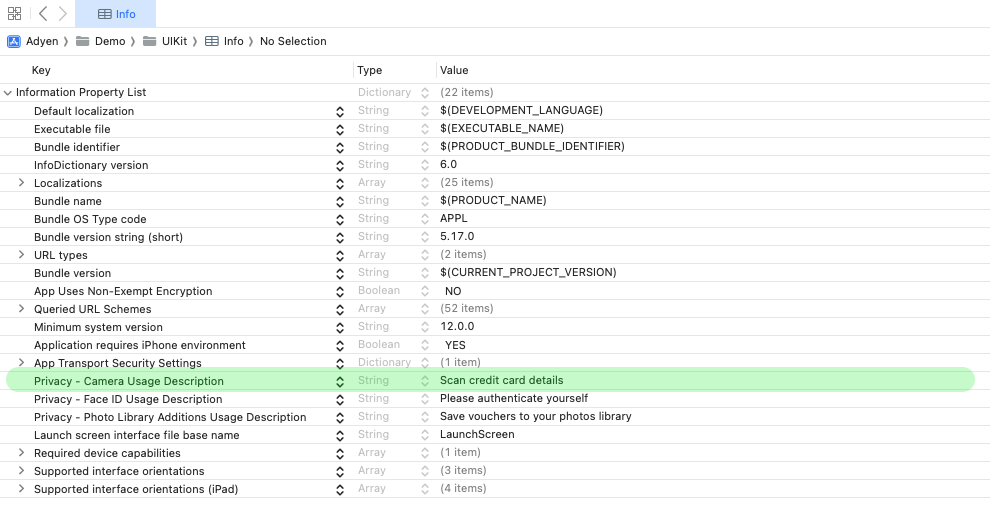

# Adyen CardScanner iOS SDK

The **AdyenCardScanner iOS SDK** provides an easy-to-use interface for integrating credit and debit card
scanning into your iOS applications. With minimal setup, the SDK enables users to scan their cards using
the device’s camera, improving the checkout experience by reducing manual input. This document covers setup
requirements, integration steps, and a complete example to help you get started quickly.

## Requirements

- iOS 13.0 or higher
- Swift 5.0 or higher
- Xcode 15 or higher

## Integration

1. Set up camera permission

    To access the camera, add the following key to your `Info.plist`. 
    You can also edit your Into.plist file andd add it directly.

    ```xml
    <key>NSCameraUsageDescription</key>
    <string>We need access to your camera to scan your card.</string>
    ```
   


2. Set Up and Present the Card Scanner
    To initiate the card scanning flow:

    - Create the card scanner view controller.
    - Implement your business logic in the scanner’s completion block (e.g., handling the scanned card data).
    - Present the view controller where needed in your app.
    - Once a card is successfully scanned, the scanner view controller will automatically dismiss, and your completion block will be triggered.

### Example integration

```swift

import UIKit
import AdyenCardScanner

class ViewController: UIViewController {

    func presentCardScanner() {
        // Check if card scanning is supported on this device
        guard CardScanner.isAvailable else {
            print("Card scanning is not available on this device.")
            return
        }

        // Create the card scanner view controller
        let scannerVC = CardScanner.createCardScanner(localizationBundle: .main) { result in
            switch result {
            case .success(let details):
                // The scanned card by the user. The result of the scan are in details.
                print("Scanned card number: \(details.cardNumber)")
            case .failure(let error):
                // The card scan failed.
                print("Scanning failed: \(error.localizedDescription)")
            }
        }

        // Present the scanner if creation was successful
        if let scannerVC {
            present(scannerVC, animated: true)
        }
    }
}
```

## License

This repository is open source and available under the MIT license. For more information, see the LICENSE file.

