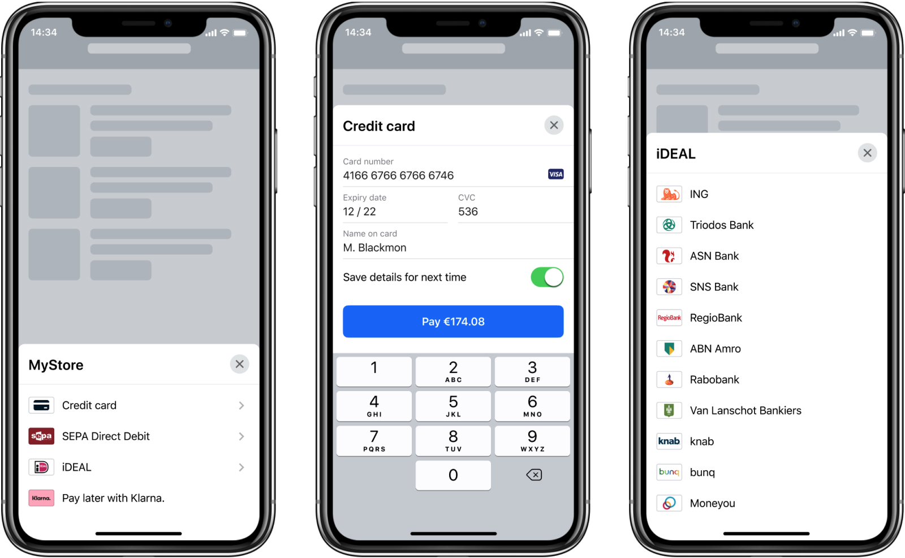

# Demo

Sample project to try out iOS Drop-in and Components integrations.

## Configuration

To start testing SDK, you need to open `Adyen.xcodeproj` in Xcode and provide the following information to `Demo/Configuration.swift`

| Field name | Placeholder | Description |
| ------------- |:-------------:| ----- |
| Adyen Client key| **{YOUR_CLIENT_KEY}** | We use your client key to authenticate requests from your payment environment. [How to get Client key](https://docs.adyen.com/development-resources/client-side-authentication#get-your-client-key) |
| Demo server API key | **{YOUR_DEMO_SERVER_API_KEY}** | Each API request that you make to Adyen is processed through an API credential linked to your company account. [How to get API key](https://docs.adyen.com/development-resources/api-credentials#generate-api-key)] |
| Apple MerchantID | **{YOUR_APPLE_PAY_MERCHANT_IDENTIFIER}** | A merchant identifier uniquely identifies you as a merchant who can accept Apple Pay payments. Provide your Apple MerchantID to `Configuration.swift` and `Shared.entitlements`. [How to create MerchantID](https://docs.adyen.com/payment-methods/apple-pay/enable-apple-pay#create-merchant-identifier) |
| Adyen's merchant identifier | **{YOUR_MERCHANT_ACCOUNT}**  | Your Adyen merchant account name. You can also change the merchant identifier in 'Options' (top right corner). |

DISCLAIMER:
Provide API-key to `Configuration.swift` for test purposes only!
The market-ready application must not connect to Adyen API directly.

## Structure

### Shared code

The `Common` folder contains all basic code necessary to handle UI, Adyen checkout's state, and network calls.

#### Drop-in sample

In `IntegrationExampleDropIn.swift` you can find example setup for DropIn integration.
You can try different UI customization and component configurations.

#### Components sample

In `IntegrationExampleComponents.swift` you can find example setup for different components integration.
You can try different components and UI customizations.

#### Partial payments sample

In `IntegrationExamplePartialPayment.swift` you can find example setup for partial payment integration.
This example is used to support Drop-in gift card flow.

### UIKit Demo

This is the basic UI for UIKit integration.
Run the UIKit Demo by selecting `AdyenUIHost` as the target in Xcode.

### SwiftUI Demo

This is the basic UI for SwiftUI integration.
Run the SwiftUI Demo it by selecting `AdyenSwiftUIHost` as the target in Xcode.
