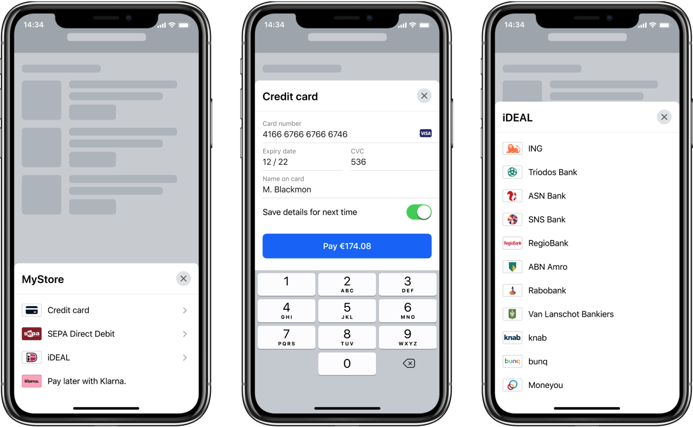

# Demo

Sample project to try out iOS Drop-in and Components integrations.



## Configuration

### Setup using .xcconfig files

The demo app uses xcconfig files for secure secret management. To set up your local development environment:

1. Create the following file(s) in the `Demo` folder (these files are git-ignored), by copying `Demo/Secrets.template.xcconfig` and renaming the copy (e.g. to `Secrets.test.xcconfig`):
   - `Secrets.test.xcconfig` - For test environment
   - `Secrets.beta.xcconfig` - For beta environment
   - `Secrets.live.xcconfig` - For production environment
   
   > **⚠️ IMPORTANT:** Copy these files directly in Finder or using terminal commands like `cp`. Do not copy them using Xcode's "Add Files" or drag and drop functionality, as this will add references to these files in the project structure (.xcodeproj file), causing build failures in CI environments where these files don't exist.

2. Fill in required configuration values in each file:

| Variable Name | Value | Description |
| ------------- | ----- | ----------- |
| ADYEN_CLIENT_KEY | your_client_key_here | We use your client key to authenticate requests from your payment environment. [How to get Client key](https://docs.adyen.com/development-resources/client-side-authentication#get-your-client-key) |
| ADYEN_DEMO_SERVER_API_KEY | your_api_key_here | Each API request that you make to Adyen is processed through an API credential linked to your company account. [How to get API key](https://docs.adyen.com/development-resources/api-credentials#generate-api-key) |
| ADYEN_MERCHANT_ACCOUNT | your_merchant_account_here | Your Adyen merchant account name. You can also change the merchant identifier in app 'Settings' (top right corner). [How to create MerchantID](https://docs.adyen.com/payment-methods/apple-pay/apple-pay-certificate/ios/#create-merchant-identifier) |
| APPLE_TEAM_IDENTIFIER | your_team_id_here | Your Apple Developer Team Identifier. |
| APPLE_PAY_MERCHANT_IDENTIFIER | your_apple_pay_merchant_id_here | A merchant identifier that uniquely identifies you as a merchant who can accept Apple Pay payments. |

3. Update the `Secrets.xcconfig` file to import your chosen environment file:

```
#include? "Secrets.test.xcconfig" // Change to the environment you want to use
```

## Structure

### Shared code

The [`Common`](Common/) folder contains all basic code necessary to handle UI, Adyen checkout's state, and network calls.

### Integration examples

#### Session

##### Drop-in

In [`Common/IntegrationExamples/Session/DropIn/DropInExample.swift`](Common/IntegrationExamples/Session/DropIn/DropInExample.swift) you can find example setup for DropIn integration.
You can try different UI customization and component configurations.

##### Components

The following component examples can be found in the [`Common/IntegrationExamples/Session/Components/`](Common/IntegrationExamples/Session/Components/) directory:
- [`CardComponentExample.swift`](Common/IntegrationExamples/Session/Components/CardComponentExample.swift) - Example for card payments
- [`ApplePayComponentExample.swift`](Common/IntegrationExamples/Session/Components/ApplePayComponentExample.swift) - Example for Apple Pay integration
- [`InstantPaymentComponentExample.swift`](Common/IntegrationExamples/Session/Components/InstantPaymentComponentExample.swift) - Example for instant payment methods
- [`IssuerListComponentExample.swift`](Common/IntegrationExamples/Session/Components/IssuerListComponentExample.swift) - Example for issuer list payments

#### Advanced flow

##### Drop-in (with partial payments support)

In [`Common/IntegrationExamples/AdvancedFlow/DropIn/DropInAdvancedFlowExample.swift`](Common/IntegrationExamples/AdvancedFlow/DropIn/DropInAdvancedFlowExample.swift) you can find example setup for:
- Advanced Drop-In integration
- Partial payment integration (gift card flow)

##### Components

Advanced flow examples for components can be found in the [`Common/IntegrationExamples/AdvancedFlow/Components/`](Common/IntegrationExamples/AdvancedFlow/Components/) directory:
- [`CardComponentAdvancedFlowExample.swift`](Common/IntegrationExamples/AdvancedFlow/Components/CardComponentAdvancedFlowExample.swift)
- [`ApplePayComponentAdvancedFlowExample.swift`](Common/IntegrationExamples/AdvancedFlow/Components/ApplePayComponentAdvancedFlowExample.swift)
- [`InstantPaymentComponentAdvancedFlowExample.swift`](Common/IntegrationExamples/AdvancedFlow/Components/InstantPaymentComponentAdvancedFlowExample.swift)
- [`IssuerListComponentAdvancedFlowExample.swift`](Common/IntegrationExamples/AdvancedFlow/Components/IssuerListComponentAdvancedFlowExample.swift)

### UIKit Demo

This is the basic UI for UIKit integration.
Run the UIKit Demo by selecting `AdyenUIHost` as the target in Xcode.

### SwiftUI Demo

This is the basic UI for SwiftUI integration.
Run the SwiftUI Demo it by selecting `AdyenSwiftUIHost` as the target in Xcode.
