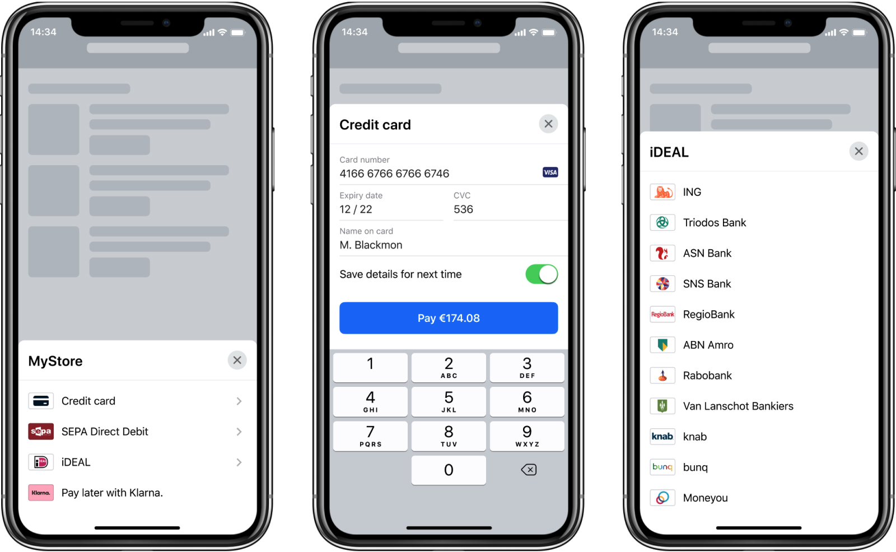

[](http://cocoapods.org/pods/Adyen)
[](https://github.com/Carthage/Carthage)
[](https://swiftpackageregistry.com/Adyen/adyen-ios)
[](https://codecov.io/gh/Adyen/adyen-ios)
[](https://codebeat.co/projects/github-com-adyen-adyen-ios-develop-1c0e3b5f-18cc-43c2-ba3c-c0c0743a3ff6)

[](https://sonarcloud.io/dashboard?id=Adyen_adyen-ios)
[](https://sonarcloud.io/component_measures/metric/reliability_rating/list?id=Adyen_adyen-ios)
[](https://sonarcloud.io/component_measures/metric/security_rating/list?id=Adyen_adyen-ios)
[](https://sonarcloud.io/dashboard?id=Adyen_adyen-ios)
[](https://sonarcloud.io/dashboard?id=Adyen_adyen-ios)
[](https://sonarcloud.io/dashboard?id=Adyen_adyen-ios)


# Adyen Components for iOS

Adyen Components for iOS allows you to accept in-app payments by providing you with the building blocks you need to create a checkout experience.

<br/>



<br/>

## Installation

Adyen Components for iOS are available through either [CocoaPods](http://cocoapods.org), [Carthage](https://github.com/Carthage/Carthage) or [Swift Package Manager](https://swift.org/package-manager/).

### CocoaPods

1. Add `pod 'Adyen'` to your `Podfile`.
2. Run `pod install`.

You can install all modules or add individual modules, depending on your needs and integration type.
The `Adyen/WeChatPay` module needs to be explicitly added to support WeChat Pay.
The `Adyen/SwiftUI` module needs to be explicitly added to use the SwiftUI specific helpers..

```
pod 'Adyen'               // Add DropIn with all modules except WeChat Pay and SwiftUI.
// Add individual modules
pod 'Adyen/Card'          // Card components.
pod 'Adyen/Encryption'    // Encryption module.
pod 'Adyen/Components'    // All other payment components except WeChat Pay.
pod 'Adyen/Actions'       // Action Components.
pod 'Adyen/WeChatPay'     // WeChat Pay Component.
pod 'Adyen/SwiftUI'       // SwiftUI apps specific module.
```


:warning: _`3DS2 SDK` binary dependency through CocoaPods doesn't support `arm64` Simulator builds. `arm64` needs to be excluded as described [here](https://github.com/Adyen/adyen-ios/issues/291) to be able to make `Any Simulator` builds._

### Carthage

1. Add `github "adyen/adyen-ios"` to your `Cartfile`.
2. Run `carthage update`.
3. Link the framework with your target as described in [Carthage Readme](https://github.com/Carthage/Carthage#adding-frameworks-to-an-application).

You can add all modules or select individual modules to add to your integration. But make sure to include each module dependency modules.

* `AdyenDropIn`: DropInComponent.
* `AdyenCard`: the card components.
* `AdyenComponents`: all other payment components except WeChat Pay.
* `AdyenActions`:  action components.
* `AdyenEncryption`: encryption.
* `AdyenWeChatPay`: WeChat Pay component.
* `AdyenSwiftUI`: SwiftUI apps specific module.

:warning: _`3DS2 SDK` binary dependency through Carthage doesn't support `arm64` Simulator builds. `arm64` needs to be excluded as described [here](https://github.com/Adyen/adyen-ios/issues/291) to be able to make `Any Simulator` builds_

### Swift Package Manager

1. Follow Apple's [Adding Package Dependencies to Your App](
https://developer.apple.com/documentation/xcode/adding_package_dependencies_to_your_app
) guide on how to add a Swift Package dependency.
2. Use `https://github.com/Adyen/adyen-ios` as the repository URL.
3. Specify the version to be at least `3.8.0`.

You can add all modules or select individual modules to add to your integration.
The `AdyenWeChatPay` module needs to be explicitly added to support WeChat Pay.
The `AdyenSwiftUI` module needs to be explicitly added to use the SwiftUI specific helpers.

* `AdyenDropIn`: all modules except `AdyenWeChatPay`.
* `AdyenCard`: the card components.
* `AdyenComponents`: all other payment components except WeChat Pay.
* `AdyenActions`:  action components.
* `AdyenEncryption`: encryption.
* `AdyenWeChatPay`: WeChat Pay component.
* `AdyenSwiftUI`: SwiftUI apps specific module.

:warning: _Please make sure to use Xcode 12.0+ when adding `Adyen` using Swift Package Manager._

:warning: _Swift Package Manager for Xcode 12.0 and 12.1 has a [know issue](https://bugs.swift.org/browse/SR-13343) when it comes to importing a dependency that in turn depend on a binary dependencies. A workaround is described [here](https://forums.swift.org/t/swiftpm-binarytarget-dependency-and-code-signing/38953)._

:warning: _`AdyenWeChatPay` Module doesn't support  `arm64` Simulator builds, because of a limitation in the underlying `libWeChatSDK.a` static library dependency. `arm64` needs to be excluded as described [here](https://github.com/Adyen/adyen-ios/issues/291) or exclude `AdyenWeChatPay` from your dependencies, to be able to make `Any Simulator` builds ._

## Drop-in

The [Drop-in](https://adyen.github.io/adyen-ios/Docs/Classes/DropInComponent.html) handles the presentation of available payment methods and the subsequent entry of a customer's payment details. It is initialized with the response of [`/paymentMethods`][apiExplorer.paymentMethods], and provides everything you need to make an API call to [`/payments`][apiExplorer.payments] and [`/payments/details`][apiExplorer.paymentsDetails].

### Usage

#### Presenting the Drop-in

The Drop-in requires the response of the `/paymentMethods` endpoint to be initialized. To pass the response to Drop-in, decode the response to the `PaymentMethods` structure:

```swift
let paymentMethods = try JSONDecoder().decode(PaymentMethods.self, from: response)
```

Some payment methods need additional configuration. For example `ApplePayComponent`. These payment method specific configuration parameters can be set in an instance of `DropInComponent.PaymentmethodsConfiguration`:

```swift
let configuration = DropInComponent.PaymentMethodsConfiguration()
configuration.applePay.summaryItems = "..." // Apple Pay summary items.
configuration.applePay.merchantIdentifier = "..." // Apple Pay merchant identifier.
```
All Payment Components needs a client key, please read more [here](https://docs.adyen.com/development-resources/client-side-authentication) about the client key and how to get it.

```swift
let configuration = DropInComponent.PaymentMethodsConfiguration()
configuration.clientKey = "..." // Your client key, retrieved from the Customer Area.
```

Also for voucher payment methods like Doku variants, in order for the `DokuComponent` to enable the shopper to save the voucher, access to the shopper photos is requested, so a suitable text need to be added to key  `NSPhotoLibraryAddUsageDescription` in the application Info.plist.

After serializing the payment methods and creating the configuration, the Drop-in is ready to be initialized. Assign a `delegate` and use the `viewController` property to present the Drop-in on the screen:

```swift
let dropInComponent = DropInComponent(paymentMethods: paymentMethods,
paymentMethodsConfiguration: configuration)
dropInComponent.delegate = self
present(dropInComponent.viewController, animated: true)
```

#### Implementing DropInComponentDelegate

To handle the results of the Drop-in, the following methods of `DropInComponentDelegate` should be implemented:

---

```swift
func didSubmit(_ data: PaymentComponentData, from component: DropInComponent)
```

This method is invoked when the customer has selected a payment method and entered its payment details. The payment details can be read from `data.paymentMethod` and can be submitted as-is to `/payments`.

---

```swift
func didProvide(_ data: ActionComponentData, from component: DropInComponent)
```

This method is invoked when additional details are provided by the Drop-in after the first call to `/payments`. This happens, for example, during the 3D Secure 2 authentication flow or any redirect flow. The additional details can be retrieved from `data.details` and can be submitted to `/payments/details`.

---

```swift
func didFail(with error: Error, from component: DropInComponent)
```

This method is invoked when an error occurred during the use of the Drop-in. Dismiss the Drop-in's view controller and display an error message.

---

```swift
func didCancel(component: PresentableComponent, from dropInComponent: DropInComponent)
```

This method is invoked when user closes a payment component managed by Drop-in.

---

```swift
func didComplete(from component: DropInComponent)
```

This method is invoked when the action component finishes, without any further steps needed by the application, for example in case of voucher payment methods. The application just needs to dismiss the `DropInComponent`..

---

#### Handling an action

When `/payments` or `/payments/details` responds with a non-final result and an `action`, you can use the Drop-in to handle the action:

```swift
let action = try JSONDecoder().decode(Action.self, from: actionData)
dropInComponent.handle(action)
```

In case the customer is redirected to an external URL, make sure to let the Drop-in know when the user returns to your app. Do this by implementing the following in your `UIApplicationDelegate`:

```swift
func application(_ app: UIApplication, open url: URL, options: [UIApplicationOpenURLOptionsKey: Any] = [:]) -> Bool {
    Adyen.applicationDidOpen(url)

    return true
}
```

## Components

In order to have more flexibility over the checkout flow, you can use our Components to present each payment method individually. Implementation details of our Components can be found in our [Components API Reference][reference].

### Available Components

- [Card Component][reference.cardComponent]
- [3D Secure 2 Component][reference.threeDS2Component]
- [Apple Pay Component][reference.applePayComponent]
- [BCMC Component][reference.bcmcComponent]
- [iDEAL Component][reference.issuerListComponent]
- [SEPA Direct Debit Component][reference.sepaDirectDebitComponent]
- [MOLPay Component][reference.issuerListComponent]
- [Dotpay Component][reference.issuerListComponent]
- [EPS Component][reference.issuerListComponent]
- [Entercash Component][reference.issuerListComponent]
- [Open Banking Component][reference.issuerListComponent]
- [WeChat Pay Component][reference.weChatPaySDKActionComponent]
- [Qiwi Wallet Component][reference.qiwiWalletComponent]
- [Redirect Component][reference.redirectComponent]
- [MB Way Component][reference.mbWayComponent]
- [BLIK Component][reference.BLIKComponent]
- [Doku Component][reference.DokuComponent]

## Customization

Both the Drop-in and the Components offer a number of customization options to allow you to match the appearance of your app.
For example, to change the section header titles and form field titles in the Drop-in to red, and turn the submit button's background to blue:
```swift
var style = DropInComponent.Style()
style.listComponent.sectionHeader.title.color = .red
style.formComponent.textField.title.color = .red
style.formComponent.footer.button.backgroundColor = .purple

let dropInComponent = DropInComponent(paymentMethods: paymentMethods,
                                      paymentMethodsConfiguration: configuration,
                                      style: style)
```

Or, to create a black Card Component with white text:
```swift
var style = FormComponentStyle()
style.backgroundColor = .black
style.header.title.color = .white
style.textField.title.color = .white
style.textField.text.color = .white
style.switch.title.color = .white

let component = CardComponent(paymentMethod: paymentMethod,
                              publicKey: Configuration.cardPublicKey,
                              style: style)
```

A full list of customization options can be found in the [API Reference][reference.styles].

## Requirements

- iOS 10.0+
- Xcode 11.0+
- Swift 5.1

## See also

* [Complete Documentation](https://docs.adyen.com/developers/checkout/ios)

* [Components API Reference](https://adyen.github.io/adyen-ios/Docs/index.html)

## Support

If you have a feature request, or spotted a bug or a technical problem, create a GitHub issue. For other questions, contact our [support team](https://support.adyen.com/hc/en-us/requests/new?ticket_form_id=360000705420).

## Contributing
We strongly encourage you to join us in contributing to this repository so everyone can benefit from:
* New features and functionality
* Resolved bug fixes and issues
* Any general improvements


Read our [**contribution guidelines**](CONTRIBUTING.md) to find out how.

## License

This repository is open source and available under the MIT license. For more information, see the LICENSE file.

[reference]: https://adyen.github.io/adyen-ios/Docs/index.html
[reference.dropInComponent]: https://adyen.github.io/adyen-ios/Docs/Classes/DropInComponent.html
[reference.cardComponent]: https://adyen.github.io/adyen-ios/Docs/Classes/CardComponent.html
[reference.threeDS2Component]: https://adyen.github.io/adyen-ios/Docs/Classes/ThreeDS2Component.html
[reference.applePayComponent]: https://adyen.github.io/adyen-ios/Docs/Classes/ApplePayComponent.html
[reference.bcmcComponent]: https://adyen.github.io/adyen-ios/Docs/Classes/BCMCComponent.html
[reference.issuerListComponent]: https://adyen.github.io/adyen-ios/Docs/Classes/IssuerListComponent.html
[reference.weChatPaySDKActionComponent]: https://adyen.github.io/adyen-ios/Docs/Classes/WeChatPaySDKActionComponent.html
[reference.qiwiWalletComponent]: https://adyen.github.io/adyen-ios/Docs/Classes/QiwiWalletComponent.html
[reference.sepaDirectDebitComponent]: https://adyen.github.io/adyen-ios/Docs/Classes/SEPADirectDebitComponent.html
[reference.redirectComponent]: https://adyen.github.io/adyen-ios/Docs/Classes/RedirectComponent.html
[reference.mbWayComponent]: https://adyen.github.io/adyen-ios/Docs/Classes/MBWayComponent.html
[reference.BLIKComponent]: https://adyen.github.io/adyen-ios/Docs/Classes/BLIKComponent.html
[reference.DokuComponent]:  https://adyen.github.io/adyen-ios/Docs/Classes/DokuComponent.html
[reference.styles]: https://adyen.github.io/adyen-ios/Docs/Styling.html
[apiExplorer.paymentMethods]: https://docs.adyen.com/api-explorer/#/PaymentSetupAndVerificationService/v46/paymentMethods
[apiExplorer.payments]: https://docs.adyen.com/api-explorer/#/PaymentSetupAndVerificationService/v46/payments
[apiExplorer.paymentsDetails]: https://docs.adyen.com/api-explorer/#/PaymentSetupAndVerificationService/v46/paymentsDetails
